### Самостоятельно установить на компьютер (личный или в аудитории) виртуальную машину. Мы можете использовать VMware Workstation Player или Oracle VirtualBox (имеется на компьютерах в аудитории). Операционная система **Ubuntu 22.04.5 server** (или более актуальной версии). Устанавливайте именно серверную (консольную версию), так как она имеет меньший вес.


### 1.11. Первоначальная настройка Ubuntu

Для начала установим актуальные версии компонентов системы

```bash
sudo apt update
sudo apt upgrade
```

Далее смотрим какой ip нашей машине(или серверу) выдал роутер(провайлер)

```bash
ip address
```
Первый сетевой адаптер в списке с именем lo, с адресом 127.0.0.1 (адрес указан после слова inet), также известным как адрес localhost – loopback-адаптер, используемый для обращения ОС к себе самой, трафик этого адаптера никогда не покидает ОС и не попадает в сеть, целая подсеть 127.0.0.0/8 выделена под loopback, и, соответственно, недоступна извне. Используемый для связи с “внешним миром” адрес следует искать в секции, соответствующей адаптеру с именем, начинающимся на eth или ens. Этот интерфейс необходимо перевести в режим "Сетевой мост" или "Bridge" в настройках виртуальной машины.


*Рис 1.5. Настройка типа подключения*

После этого необходимо перезапустить виртуальную машину, либо  перезапустить сетевую службу 

Далее необходиме установить ssh сервер
```bash
sudo apt install openssh-server
```

Запустите на хостовом ПК программу PuTTY, в поле Host Name введите полученный на предыдущем шаге IP адрес Ubuntu, выберите тип подключения SSH и нажмите Open (Рисунок 1.6).


*Рис 1.6. Подключение через Putty*

Согласитесь на добавление незнакомого ключа сервера, после появления окна с приглашением login as: введите имя пользователя, нажмите Enter, введите пароль, нажмите Enter. Вы можете открыть несколько параллельных сессий от имени одного пользователя в новых окнах PuTTY, что может быть удобно, если потребуется одновременно изменять конфигурацию и отслеживать сообщения в интерфейсе какого-либо ПО.

Если Вы получаете ошибку, при вводе команды, которая начинается с *sudo*, то Ваш пользователь при установке не был добавлен в группу администраторов (пользователей с привилегиями sudo). Следует под пользователем root добавить его в группу пользователей sudo (wheel) вручную командой 

``` bash
usermod -aG wheel username
```

*Команда su переключает сессию текущего пользователя на суперпользователя root, поэтому пароль необходимо вводить от учетной записи root.
Для применения изменений требуется полностью выйти из системы с помощью команды exit и авторизоваться под Вашим пользователем заново.*

### Далее естановим все необходимые пакеты:

Установите пакет wget для скачивания файлов по URL ссылке, клиенты систем управления версиями git и svn, компиляторы gcc gcc -c++ и дополнительные пакеты для сборки проектов из исходного кода по Makefile:


```bash
sudo apt install wget git gcc gcc-c++ svn cmake make automake autoconf pkgconfig graphviz
```
(для пакетов выше. Может быть ошибка при попытке скачать пакеты, ввиду того, что названия были изменены разработчиками. Требуется найти актуальные пакеты и установить)

```bash
sudo apt -y install curl libnewt-dev libssl-dev libncurses5-dev subversion libsqlite3-dev build-essential libjansson-dev libxml2-dev uuid-dev
```
```bash
sudo apt-get install codec2
sudo apt-get install libedit-dev
sudo apt-get install libsrtp2-dev
sudo apt-get install unixodbc-dev
sudo apt-get install unixodbc
```

Настройка сетевого экрана.
Разрешение TCP и UDP для порта 5060:
```bash
sudo ufw allow 5060/tcp
sudo ufw allow 5060/udp
```
Разрешение TCP и UDP для порта 5061:
```bash
sudo ufw allow 5061/tcp
sudo ufw allow 5061/udp
```
Разрешение UDP для порта 4569:
```bash
sudo ufw allow 4569/udp
```
Разрешение диапазона портов 10000-20000 UDP:
```bash
sudo ufw allow 10000:20000/udp
```
Разрешение на подключение по порту 22 (SSH):
```bash
sudo ufw allow 22
```
Запуск сетевого экрана:
```bash
sudo ufw enable
```

## Раздел 2. Сборка и начальная конфигурация сервера VoIP телефонии Asterisk
### 2.1 Установка Asterisk
Asterisk устанавливается путем сборки из исходного кода. Полная установка проходит в 3 этапа:
1. (опц) Установка DAHDI (драйвера плат FXO интерфейсов);
2. (опц) Установка LibPRI (библиотека для работы с потоковыми TDM-интерфейсами);
3. Сборка и установка Asterisk.


При использовании тестового стенда на ВМ можно пропустить первые 2 пункта, поскольку использование спец оборудования не подразумевается, поэтому сразу приступим к сборке Asterisk. Архив с исходным кодом требуемой 18 версии Asterisk  asterisk-18-current.tar.gz лежит на github; скачайте архив на свой ПК. Для того, чтобы перенести файл архива с хостового компьютера в Ubuntu, воспользуемся протоколом передачи файлов SCP (от англ. secure copy), который работает поверх SSH. Запустите на хостовом ПК программу WinSCP (необходимо предварительно установить), которая представляет собой клиент таких протоколов передачи данных, как FTP SFTP SCP WebDAV и тд. В окне входа выберите протокол SCP, в поле Имя хоста укажите IP адрес Ubuntu, укажите имя пользователя и пароль в соответствующих полях (аналогично подключению по SSH). Нажмите войти (Рисунок 2.1).


*Рис 2.1. Настройка параметров соединения*

В режиме Коммандер WinSCP отображает слева папки Вашего локального пользователя на хостовом ПК, а справа домашнюю директорию пользователя, под которым Вы подключились к серверу (к Ubuntu). В левой части перейдите в папку, в которую Вы ранее скачали архив с исходным кодом Asterisk, выберите и перетащите нужный файл мышью на правую половину, убедитесь, что он появился в домашней директории Вашего пользователя на Ubuntu (Рисунок 2.2).


*Рис 2.2. Настройка директории пользователя*

Не рекомендуется использование wget для скачивания архива напрямую на сервер тк это будет кратно дольше

Распаковка архива и переход в папку с извлеченными файлами:
```bash
tar xvf asterisk-18-current.tar.gz
```
```bash
cd asterisk-18*/
```

Добавление пакетов для работы с mp3:
```bash
contrib/scripts/get_mp3_source.sh
```

> если на этапе добавления пакетов mp3 происходит вечная установка, то необходимо перейти использовать следующий вариант установки: пропустить добавление работы с mp3

Скачиваем пакеты для работы с аудио форматом wav для русского и английского варианта.

```
apt install asterisk-core-sounds-en-gsm asterisk-core-sounds-ru-gsm asterisk-moh-opsound-gsm
```
Также докачиваем пакеты для работы с opensound

```
apt-get install asterisk-moh-opsound-wav
```

Очищение директории от существующих файлов конфигурации сборки:
```bash
make distclean
```
Конфигурация параметров сборки Asterisk 
```bash
sudo ./configure
```
Полный перечень опций и что они означают можно посмотреть командой *./configure -h*

В случае успешного конфигурирования в конце должна быть получена следующая картина (Рисунок 2.3).


*Рис 2.3. Подтверждение успешной конфигурации*

Меню выбора требуемых компонентов, модулей и приложений Asterisk:
```bash
sudo make menuselect
```


*Рис 2.4. Меню выбора модулей*

Необходимые компоненты:

-	Add-ons: format_mp3;
-	Call Detail Recording: убрать cdr_sqlite3_custom;
-	Channel Event Logging: убрать cel_sqlite3_custom;
-	Channel Drivers: оставить только chan_iax2, chan_pjsip, chan_rtp;
-	Codec Translators: добавить codec_opus;
-	Resource Modules: убрать res_agi, все пункты с res_ari, res_fax, res_phoneprov, res_smdi (эти модули не нужны в данной установке и вызывают появление ошибок при запуске);
-	Compiler Flags: LOW_MEMORY, G711_NEW_ALGORITHM, G711_REDUCED_BRANCHING;
-	Core Sound Packages: оставить полностью пустым.
- Music On Hold File Packages: оставить полностью пустым.
-	Extra Sound Packages: оставить полностью пустым.


После этого выйдите, нажав ***Save & Exit***.

Запуск процесса сборки:
```bash
sudo make
```
Если сборка прошла успешно, отобразится сообщение об успешном завершении и возможности установить собранный пакет (Рисунок 2.5).


*Рис 2.5. Подтверждение успешной сборки*

Установка собранного пакета Asterisk:
```bash
sudo make install
```


*Рис 2.6. Подтверждение успешной сборки*

Создание службы systemd для Asterisk и конфигурационных файлов по умолчанию:
```bash
sudo make samples
sudo make config
```

### 2.2 Базовая конфигурация и запуск Asterisk
Откройте в редакторе основной конфигурационный файл Asterisk ***/etc/asterisk/asterisk.conf***

Вы можете использовать **любой** удобный для Вас редактор (nano, vi, vim, mc и т.д.)

<details>

  <summary>При работе с редактором nano</summary>

Редактор поддержитвает ввод без дополнительных команд

Для сохранения изменений: **ctrl + o**

Для выхода из nano: **ctrl + x**

Внизу окна редактора приводится список команд для работы

 

</details>

<details>

  <summary>При работе с редактором vi</summary>

Для начала работы с редактором нажмите **i**

Выход из vi с сохранением изменений: нажать Esc ввести **:wq**

Выход из vi без сохранения: Esc **:q**

</details>

<details>

  <summary>Установка файлового менеджера mc</summary>

  

  Если vi/nano Вам неудобен для редактирования, можно установить другой текстовый редактор, например редактор файлового менеджера MidnightCommander, который помимо возможности удобно просматривать файлы и директории, предоставляет свой собственный текстовый редактор.

  Установка mc:
  ```bash
  sudo apt-get install mc
  ```
  Редактор mcedit использует ряд F-клавиш для управления, их назначение указано внизу окна на кнопках с соответствующим номером, кроме того, mc поддерживает управление мышью, можно кликнуть по верхней панели для отображения меню, а также по нижним кнопкам. Для копирования/вставки используются сочетания Ctrl-Insert/Shift-Insert соответственно (а также выделение мышью с зажатым Shift/ПКМ) (Рисунок 1.20).

  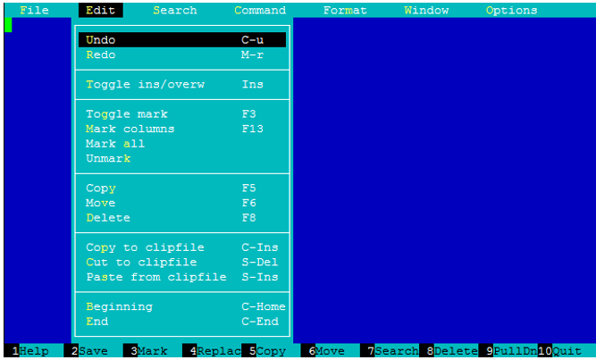
  
  
  Чтобы открыть файловый менеджер в текущей директории выполните команду mc. Для редактирования файла замените vi на mcedit в вызове редактора

</details>


Необходимо раскомментировать (удалить ;) и редактировать следующие пункты:
```bash
runuser = asterisk 
rungroup = asterisk  
defaultlanguage = ru
```
Также откройте файл ***/etc/default/asterisk*** и раскомментируйте строки ниже

```bash
AST_USER="asterisk"
AST_GROUP="asterisk"
```
Создайте группу и служебного пользователя asterisk, от имени которого будет работать служба Asterisk (этот пользователь не сможет осуществлять вход в систему):

```bash
sudo groupadd asterisk
sudo useradd -r -d /var/lib/asterisk -g asterisk asterisk
sudo usermod -aG audio,dialout asterisk
```
Смените владельца следующих директорий на пользователя *asterisk* для предоставления ему полного доступа:

```bash
sudo chown -R asterisk.asterisk /etc/asterisk
sudo chown -R asterisk.asterisk /var/{lib,log,spool}/asterisk
sudo chown -R asterisk.asterisk /usr/lib/asterisk
sudo chmod -R 750 /var/{lib,log,run,spool}/asterisk /usr/lib/asterisk /etc/asterisk
```
Запуск Asterisk для проверки корректности установки и первоначальной конфигурации:

```bash
sudo asterisk -c
```
Если Asterisk успешно запустится, в конце вывода служебных сообщений появится зеленая надпись Asterisk Ready и приглашение командной строки Asterisk *CLI> (возможно появление предупреждений и ошибок — это обусловлено особенностями сгенерированной конфигурации по умолчанию, которая предполагает использование некоторых не сконфигурированных в текущей установке Asterisk модулей. На работоспособность в целом не влияет).*

Выход обратно в bash: ***Ctrl+C***.

Запретите загрузку вызывающих ошибки модулей, которые не понадобятся в текущей работе:

```bash
sudo vi /etc/asterisk/modules.conf
```
вставить после строки *autoload=yes*:

```bash
noload => pbx_dundi
noload => res_config_ldap
noload => res_pjsip_phoneprov_provider
```

Если на предыдущем шаге Asterisk успешно запустился, можно запустить Asterisk как фоновую службу с автозапуском на старте ОС:

```bash
sudo systemctl restart asterisk && sudo systemctl enable asterisk
```
Проверьте, что Asterisk корректно запущен в виде фоновой службы:


Если служба корректно запущена и работает, в выводе должно быть указано active (running) (Рисунок 2.7).
```bash
systemctl status asterisk
```


*Рис 2.7. Служба asterisk успешно запущена*

Если получено иное, перезапустите службу и еще раз проверьте статус:
```bash
sudo systemctl restart asterisk
```

```bash
sudo systemctl status asterisk
```
Проверьте возможность подключения к интерфейсу CLI Asterisk:

```bash
sudo asterisk -vvvr
```

Подключаться к Asterisk Вам потребуется позже при отладке конфигурации, пока что выйдите обратно в bash.

Для установки кодека OPUS необходимо сделать следующие действия

Скачать кодек с помощью wget
```bash
sudo wget https://downloads.digium.com/pub/telephony/codec_opus/asterisk-18.0/x86-64/codec_opus-18.0_1.3.0-x86_64.tar.gz
```
Далее необходимо загрузить этот модуль в asterisk, отредактировав файл */etc/asterisk/modules.conf*
Добавим строку

```bash
load => codec_opus.so
```
Перезапустим службу asterisk. И проверим успешную загрузку кодека OPUS.
Снова подключимся к интерфейсу CLI Asterisk и введем команду для того, чтобы посмотреть какие кодеки он поддерживает

```bash
core show codecs
```


*Рис 2.8. Кодек OPUS подключен*

### 2.3. Конфигурация Asterisk для обработки вызовов

Чтобы Asterisk начал обрабатывать телефонные вызовы, необходимо сконфигурировать параметры канала связи (драйвер протокола SIP в данном случае) и план набора (dialplan). Протокол SIP представлен в Asterisk двумя драйверами канала – старым, проприетарным chan_sip и новым, открытым кроссплатформенным PJSIP. Преимущества последнего помимо кроссплатформенности в стабильности, активном развитии (исправлении багов и уязвимостей, оптимизации и обновлении), поддержке дополнительных протоколов (TURN и тд) для обеспечения лучшей проходимости трафика SIP через NAT, в возможности осуществлять множество регистраций на одну учетную запись клиента. Таким образом, для данной работы был выбран PJSIP как более функциональное современное решение. План набора конфигурируется как описание логики обработки вызовов практически одинаково для любого типа канала, отличия только в вызываемом приложении внутри записи экстеншена (пункт диалплана).


Для конфигурации Asterisk в качестве IP АТС согласно изложенному ранее, необходимо отредактировать два основных конфигурационных файла:
1) **pjsip.conf**, в котором указываются сведения о транспортном протоколе, разрешенных кодеках, клиентах и регистрациях SIP, пользователи с соответствующими идентификаторами-номерами, параметры регистрации и аутентификации;
2) **extensions.conf**, описывающий план набора - dialplan, правила обработки и маршрутизации вызовов.

**После внесения изменений в любой конфигурационный файл Asterisk, служба Asterisk должна быть перезапущена для применения изменений!!!**
```
sudo systemctl restart asterisk
```

Удалите файлы конфигурации, созданные по умолчанию:
```
sudo rm /etc/asterisk/extensions.conf
sudo rm /etc/asterisk/pjsip.conf
```
### 2.4. Конфигурация плана набора

#### Конфигурация extensions.conf

План набора в файле *extensions.conf* структурирован в секции, называемые контекстами. **_Контекст_** – это независимая от остальных часть внутри диалплана. Контексты используются для разделения функций, обеспечения безопасной обработки и фильтрации вызовов между различными частями, определения класса обслуживания разных пользователей и так далее.
План набора, как было сказано ранее, состоит из одного или нескольких контекстов. Контексты используются для реализации основных функций АТС, таких как:


-	**безопасность** – можно разрешить вызовы на определенные номера только конкретным абонентам;
-	**маршрутизация вызовов** – маршрутизация вызовов в зависимости от номера абонента;
-	**многоуровневые голосовые меню** – голосовые меню для службы поддержки, отдела продаж и т.д;
-	**авторизация** – запрос пароля для вызова на некоторые номера;
-	**обратный вызов**;
-	**списки доступа** – занесение в черные списки нежелательных абонентов;
-	**виртуальные АТС** – возможность создавать независимые виртуальные АТС в пределах Вашей основной АТС;
-	**дневной/ночной режим работы** – изменение поведения АТС в зависимости от времени;
-	**макросы** – можно создавать скрипты для решения повторяющихся задач в плане набора.

Каждый контекст – это набор расширений (extension). Каждый экстеншен в контексте имеет уникальное имя, которое обычно является числовым идентификатором, присвоенным линии, идущей к конкретному телефону.

Синтаксис расширения начинается с выражения ***exten =>*** Далее указывается имя (или номер) экстеншена. В традиционных системах телефонной связи под номерами понимаются номера из цифр, которые надо набрать, чтобы позвонить определенному абоненту с этим номером. В Asterisk понятие имени (номера) намного шире, в качестве имени добавочного номера может использоваться любая комбинация цифр и букв. Полный экстеншен состоит из трех компонентов:


1.	имени (или номера);
2.	приоритета (каждый добавочный номер может включать множество шагов обработки вызова, порядковый номер шага называется его приоритетом);
3.	приложение (или команда), которое выполняет некоторое действие над вызовом.


Эти три компонента разделяются запятыми:
> exten => имя,приоритет,приложение()

Приведём пример простейшего экстеншена:

>exten => 123,1,Answer()

В этом примере имя добавочного номера – 123, приоритет – 1, а приложение – Answer().

В начале диалплана также можно разместить два специальных контекста, [general] и [globals]:
[general] содержит список общих настроек диалплана;
[globals] - глобальные переменные.
Ниже приведен пример простейшего плана набора (реализует обработку звонков на любые трехзначные номера) в контексте *default*, который должен быть, сохранен в файле */etc/asterisk/extensions.conf*

```
[default]

exten => _XXX,1,Dial(PJSIP/${EXTEN})
```

Теперь рассмотрим реализацию простого голосового меню с подробным описанием процесса маршрутизации и обработки вызовов.

```
[internal]

exten => 1234,1,GoTo(ivr,s,1)

[ivr]

exten => s,1,Answer()

same => n,Playback(hello)

same => n,Background(basic-pbx-ivr-main)

same => n,Playback(demo-thanks)


exten => 1,1,GoTo(1-otd,s,1)

[1-otd]

exten => s,1,Background(one-moment-please)

same => n,GoTo(ivr,s,4)
```

При звонке клиента из контекста ***internal*** на номер 1234 происходит перенаправление вызова приложением ***GoTo*** в контекст ***ivr*** на соответствующий экстеншен с именем s и приоритетом 1. Далее пошагово идёт обработка вызова: ”поднимается трубка” приложением *Answer*, проигрывается звуковая запись ***hello*** с помощью приложения ***Playback*** (по умолчанию Asterisk ищет записи в  ***/var/lib/asterisk/sounds*** для указанного в конфигурации языка), далее проигрывается запись ***basic-pbx-ivr-main*** с помощью приложения Background. Отличие между этими двумя приложениями состоит в том, что во втором случае Asterisk во время проигрывания звукового файла прослушивает линию на предмет ввода дополнительного номера в тональном режиме (DTMF). При вводе 1 обработка вызова передается в контекст ***1-otd***. Если ввода не последовало, проигрывается demo-thanks и вызов завершается, поскольку больше нет настроенных экстеншенов для дальнейшей обработки вызова.
### Задание 

### Создайте контекст с произвольным именем, настройте обработку внутренних 4-значных номеров, определите отдельно любой произвольный номер, при вызове на который *Asterisk* будет проигрывать запись *num-was-successfully* и принудительно завершать вызов с помощью приложения *Hangup().*

#### Конфигурация PJSIP

Настройки PJSIP в Asterisk производятся через текстовый файл конфигурации *pjsip.conf*, состоящий из секций. Общий вид секций стандартен для всех конфигурационных файлов Asterisk

- начинается с указания имени секции в скобках[]. Основное отличие в структуре конфигурационного файла PJSIP от классического драйвера chan_sip, в том, что конфигурация SIP-клиентов разбивается на логические разделы:

- ***Endpoint*** – соответствует клиенту или транку SIP, содержит описание основных параметров клиента, его принадлежность к контексту и определяет связь с остальными обязательгымиг модулями, такими как Transport, Auth и AOR;

- ***Transport*** – данный раздел описывает тип транспортного протокола для подключаемых устройств, доступны TCP, UDP, TLS, а также WebSocket. Возможно использовать один раздел для многих конечных точек (разделов Endpoint), также можно при необходимости для раздела Endpoint создать свой собственный раздел Transport;

- ***Auth*** – раздел, содержащий параметры аутентификации для исходящей или входящей регистрации SIP, с данным разделом связаны разделы Endpoint и Registrations. Одна запись раздела Auth при необходимости может использоваться несколькими разделами Endpoint и Registration (т.е. имя пользователя для регистрации совсем необязательно соответствует номеру пользователя);

- ***AOR (Address of Record)*** – раздел по своей сути является указателем для Asterisk, каким образом связаться с точкой (Endpoint). Без соответствующей записи в AOR не будет возможности вызвать подключаем конечную точку (телефонный аппарат клиента или передать вызов в транк оператора);

- ***Registration*** – раздел, отвечающий за исходящую регистрацию, например, регистрация Asterisk на сервере оператора связи. Для корректной работы данного раздела обязательно должны присутствовать две опции в которых указываются имена используемых разделов: раздел Transport (опция transport) и раздел Auth (опция outbound_auth); также обязательна опция type.


Пример конфигурации транспорта SIP и создание клиента с 3-значным номером, описанные в файле ***/etc/asterisk/pjsip.conf***
```
[udp–transport]

type=transport

protocol=udp

bind=0.0.0.0

[101]

type=endpoint

transport=udp–transport

context=default

disallow=all

allow=g726,gsm

auth=101

aors=101

[101]

type=auth

auth_type=userpass

password=verysecuresupercoolencryptedpassword

username=101

[101]

type=aor

max_contacts=1
```

Посмотреть, какие кодеки поддерживает Asterisk можно выполнив команду:
```
*CLI> core show codecs*
```
### Задание

### Создайте конфигурацию для 2-х клиентов, каждому из которых соответствует 4-значный номер (номера выберите сами), привяжите к ранее созданному в плане набора контексту, разрешите использование только кодеков OPUS, G.711 A-law (корректные имена кодеков узнайте самостоятельно).

>Обратите внимание, PJSIP очень чувствителен к корректности синтаксиса файла конфигурации, даже отсутствие/наличие пробела там, где он должен/не должен быть приводит к полной неработоспособности. Перезапустите службу Asterisk после изменения файлов конфигурации.

Теперь проверим, что Asterisk готов принимать вызовы, приходящие по сети, для этого нужно убедиться, что прослушивается порт SIP – 5060. Получить статистику по открытым портам и соединения можно с помощью нескольких команд, одна из них – *ss:*

```
ss -ulpn
```

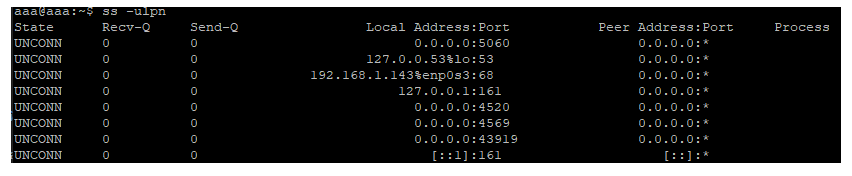

*Рис 2.9. Получение статистики об открытых портах и соединениях*

### 2.5. Протоколы SIP и RTP
Современная IP-телефония строится на связке сигнальных протоколов и протоколов передачи данных реального времени. В качестве сигнального протокола, обеспечивающего установление сессий передачи данных наибольшую популярность, обрел SIP в связке с SDP, непосредственно для передачи данных используется протокол прикладного уровня RTP и тесно связанный с ним транспортный протокол RTCP.


**Session Initiation Protocol (SIP)** – это клиент-серверный протокол сигнализации прикладного уровня, предназначенный для установления, модификации и окончания сеансов связи с одним или несколькими участниками для обмена мультимедийным трафиком [8]. SIP использует текстовые сообщения, в которых используется кодировка UTF-8, работает на порту 5060, как в случае использования транспортного протокола UDP, так и TCP [9]. Описан в RFC 3261.


Основными функциями SIP являются:

- **определение местонахождения адресата**;
- **определение готовности адресата установить контакт**;
- **обмен данными о функциональных возможностях участников сеанса**;
- **изменение параметров медиапотока уже установленного сеанса**;
- **управление сеансом связи**.


Основными функциональными элементами являются:
- **абонентский терминал** (User Agent). SIP-клиент, реализованный как АО (VoIP телефон/VoIP-шлюз) или ПО (PhonerLite, SIPp), с помощью которого абонент совершает вызовы;

- **прокси-сервер**. Узел в сети, принимающий и обрабатывающий запросы от терминалов, выполняя соответствующие этим запросам действия и возвращая ответы. Прокси-сервер может принимать вызовы, переадресовывать их, вносить изменения в передаваемые сообщения SIP (например, для преодоления NAT), инициировать запросы к клиентам;

- **сервер переадресации**. Узел, хранящий записи о текущем местоположении всех зарегистрированных в сети клиентах (терминалах) и прокси-серверах. Сервер переадресации только переадресует вызовы и не генерирует собственные запросы;

- **сервер регистрации / определения местоположения пользователей (Register)**. Представляет собой базу данных адресной информации (IP-адресов). Необходим для обеспечения мобильности пользователей. Чаще всего совмещен с прокси-сервером.


Asterisk в стандартной установке совмещает все 3 последние упомянутые роли.
В протоколе SIP определено 6 основных запросовов (Табл. 2.1).


**Таблица 2.1. Основные запросы в протоколе SIP**

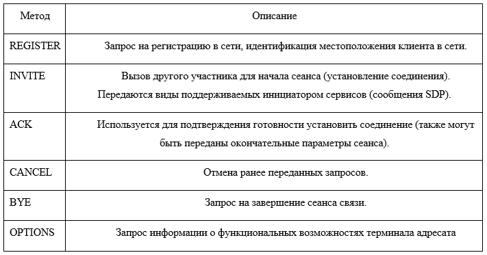


Позднее SIP был расширен введением функций обмена мгновенными сообщениями и получения информации о статусе клиента. Дополнительные методы, описаны в RFC:

-	**info**: Расширение протокола, описанное в RFC 2976;
-	**notify**: Расширение протокола, описанное в RFC 2848;
-	**subscribe**: Расширение протокола, описанное в RFC 2848;
-	**unsubscribe**: Расширение протокола, описанное в RFC 2848;
-	**update**: Запрос на изменение параметров сеанса, описан в RFC 3311;
-	**message**: Расширение протокола, описанное в RFC 3428;
-	**refer**: Расширение протокола, описанное в RFC 3515.


Для SIP определено 6 кодов ответа, которыми прокси-сервер описывает состояние соединения, например: подтверждение установления соединения, передача запрошенной информации, сведения о неисправностях и пр. Все классы ответов, кроме 1 завершают выполнение запроса.
1.	**1хх** – Информационные ответы, сообщают о ходе выполнения запроса;
2.	**2хх** – Успешное окончание запроса;
3.	**3хх** – Информация об изменения местоположения вызываемого абонента;
4.	**4хх** – Информация об ошибке;
5.	**5хх** – Информация об ошибке сервера;
6.	**6хх** – Информация о невозможности вызова абонента (пользователь с таким адресом не зарегистрирован, или пользователь занят).


Непосредственным носителем голосовых или видеоданных является протокол **RTP (Real-time Transport Protocol)**, SIP-сообщение же выполняет роль контейнера для сообщений протокола описания сеансов связи SDP (Session Description Protocol RFC 4566).

Протокол SDP используется для согласования параметров сессии передачи данных. Сообщение SDP описывает медиаданные в рамках сессии: тип медиаданных, транспортный протокол, кодек и тд.  Последнее позволяет выполнять более совершенное управление голосовыми вывозами с переадресациями и продвинутой маршрутизацией. SIP поддерживает также приглашение участников к текущим сеансам наподобие многоточечных конференций, добавление к текущему сеансу или удаление из него мультимедийных данных, прозрачное распределение имён и перенаправление услуг, включая персональную мобильность пользователя.

**RTP** – транспортный протокол для передачи трафика реального времени (в том числе потоковой передачи мультимедийного трафика) [9]. Для передачи и контроля параметров соединения используется протокол RTCP.

### 2.6. Настройка клиентов

В терминале подключитесь к службе Asterisk (*sudo asterisk -vvvr*), оставьте открытой консоль Asterisk, чтобы там видеть информационные сообщения о регистрации клиентов и обработке вызовов. Скачайте на свой компьютер архив *PhonerLite.zip*, который хранится на gitlab (или скачайте самостоятельно с сайта), разархивируйте его в 2 разные папки для двух разных клиентов. Сначала проделайте все указанные ниже шаги для одного клиента, если клиент успешно зарегистрировался и может совершить звонок на номер Asterisk с проигрыванием записи *num-was-succesfully*, то сконфигурируйте и второго клиента для 2 номера.

Запустите приложение PhonerLite.exe, выберите manual configuration. В строке Proxy/Registrar укажите IP-адрес Asterisk, нажмите далее (кнопка со стрелкой влево), введите имя пользователя и пароль (из секции Auth pjsip.conf). Завершите оставшиеся этапы конфигурации клиента.

Если регистрация клиента на сервере прошла успешно, внизу окна появится соответствующая надпись и индикатор будет зелёным, а в интерфейсе Asterisk появятся сообщения о том, что прошла регистрация и клиент с указанным номером стал доступен (Рисунок 2.8).


*Рис 2.10. Проверка успешной регистрации клиента на сервере*

Во вкладке ***Configuration*** – ***Network*** снимите выделение с пункта *Multicast DNS*, нажмите *Save.*

*Иначе возможны некоторые нежелательные ситуации, поскольку клиенты могут находить друг друга в сети посредством рассылки запросов и при вызове могут игнорировать Asterisk.*

Первому клиенту PhonerLite поставьте первым разрешенным приоритетом кодек Opus, второму – G.711 A-law, совершите звонок. Убедитесь, что в консоли Asterisk отображается информация об обработке вызова, если нет, проверьте, что неактивен пункт Multicast DNS, закройте клиенты, перезапустите Asterisk, откройте консоль Asterisk, запустите клиенты и попробуйте заново.

### 2.7. Отладка SIP протокола
Модуль *res_pjsip_history* сохраняет в памяти историю всех отправленных и полученных SIP-сообщений, которые проходят через стек PJSIP.
Для того, чтоб начать захват, нужно выполнить следующую команду в CLI Asterisk:
```
pjsip set history on
```
Для наглядного отображения порядка проведения VoIP вызова с помощью протоколов SIP и RTP, можно использовать Wireshark - инструмента для захвата и анализа сетевого трафика. Запустите Wireshark и выберите соответствующий сетевой адаптер для захвата трафика из списка (VMnet8 для сети NAT в VMware Player).

В строке Apply a display filter введите *sip || rtp* для отфильтровывания в выводе пакетов соответствующих протоколов (Рисунок 2.9).

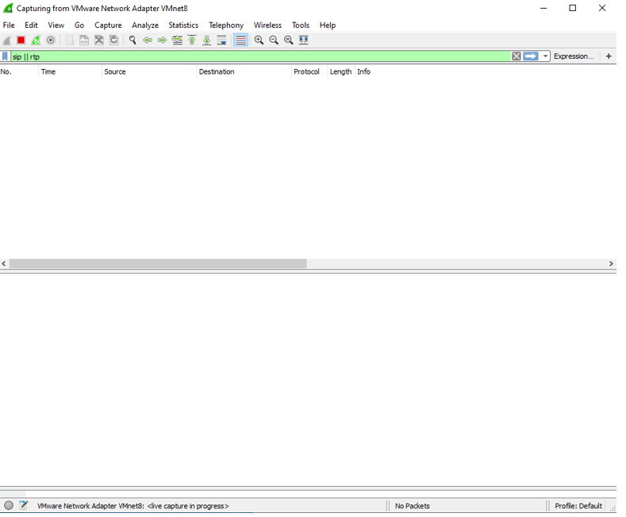

*Рис 2.11. Проведение VoIP вызова с помощью протоколов SIP и RTP*

Совершите вызов из PhonerLite второму клиенту, не забудьте принять вызов на втором PhonerLite. После завершения вызова (достаточно принять вызов и можно сразу же нажать отбой) нажмите на красный квадратик слева сверху, чтобы остановить захват трафика и перейти к его анализу.  В пункте Telephony выберите VoIP Calls, в открывшемся окне будут отображены все захваченные звонки (сеансы SIP). Выберите один из них и нажмите внизу Flow Sequence, чтобы наглядно отобразить этапы установления и завершения соединения с помощью протокола SIP.

Сравните с историей SIP сообщений на Asterisk:
```
pjsip show history
```
Также можно получить информацию о клиентах:
```
pjsip show endpoints
```

**Вопрос для самоконтроля.** Почему некоторые сообщения SIP (в частности INVITE при инициализации сеанса) клиент отправляет по 2 раза?

## Раздел 3. Настройка канала между Asterisk серверами. Realtime конфигурация

Эту часть работы удобнее всего выполнять парами, поскольку потребуется два узла Asterisk.

На одном узле *Asterisk* (назовем его *node1*) требуется добавить клиента с номером в формате 4XXX, на втором (*node2*) в формате 5XXX (помните, клиенты описываются в файле *pjsip.conf* тремя секциями – *Endpoint*, *Auth*, *AOR*), контекст укажите тот, который создали в предыдущей работе для внутренних вызовов. Назначьте клиенту произвольный идентификатор CallerID (см. пример ниже, как назначается идентификатор первому клиенту с номером 4001).

***

Пример секции Endpoint из /etc/asterisk/pjsip.conf для node1
```
[4001]
type=endpoint
transport=udp-transport
context=internal
disallow=all
allow=alaw,opus
callerid=first<4001>
auth=4001
aors=4001
```

***

**ВАЖНО!** Убедитесь, что на первом Asterisk отсутствуют настроенные номера формата 5XXX, а на втором 4XXX.

### 3.1. Краткие сведения о протоколе IAX

Среди поддерживаемых Asterisk протоколов, особое место занимает протокол **IAX**. Это протокол, созданный разработчиками Asterisk (Digium Inc.), расшифровывается как **Inter-Asterisk eXchange protocol** – протокол обмена между Asterisk. Хотя **IAX** и поддерживается некоторыми VoIP-телефонами, в первую очередь он предназначен для организации между узлами Asterisk каналов типа транк, в которых осуществляется одновременная передача данных нескольких вызовов. **IAX** первой версии в настоящее время не поддерживается ввиду наличия проблем в плане безопасности, а говоря IAX, обычно подразумевают вторую версию **IAX2**. Для работы протокола используется **UDP-порт 4569**, который предназначается не только для обмена сигнальной информацией о сеансе связи (аналогично **SIP** с **SDP**), но и для обмена голосовой информацией (аналогично RTP), таким образом, IAX берет на себя передачу и сигнальной и голосовой информации. Дополнительно следует сказать, что **IAX** – протокол, использующий бинарный формат для передачи данных, в отличие от протокола **SIP**, передающего сообщения в открытом текстовом формате, что позволяет **IAX** уменьшить объем передаваемых данных в случае использования его на транк-канале с одновременной передачей множества вызовов. Помимо этого, протокол использует агрегацию параллельных сеансов связи в рамках использования одного IAX-соединения между узлами Asterisk, так что в одном UDP-пакете может одновременно передаваться служебная и голосовая информация, принадлежащая нескольким вызовам.

Основные недостатки – сложная расширяемость (внедрение новых функций) и уязвимость старых реализаций к атакам типа DoS (версии Asterisk новее 2009 года менее подвержены этой уязвимости, поскольку есть возможность ограничить число подключений и вызовов с одного адреса, использовать дополнительно при соединении токены CallToken).

Процесс регистрации клиента IAX на сервере с настроенной аутентификацией с использованием алгоритма хэширования MD5 при поддержке CallToken (Рисунок 3.2).


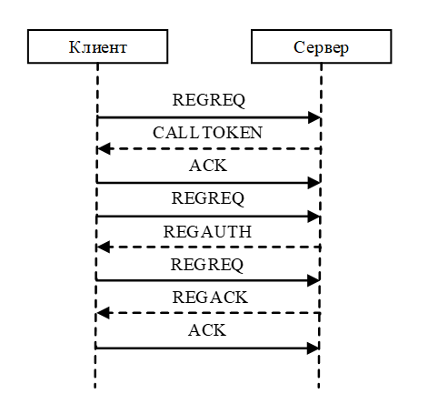

*Рис 3.1. Алгоритм хэширования MD5 при поддержке CallToken*

Первым шанрм клиент отправляет серверу сообщение **REGREQ** с информационными элементами ‘username’ (содержит имя пользователя, под которым нужно зарегистрироваться), ‘refresh’ (период обновления регистрации в секундах) и пустым ‘CallToken’;

Сервер отвечает сообщением **CALLTOKEN**, содержащим элемент CallToken с идентификатором, который должен использовать клиент;

Клиент отправляет подтверждает получение токена сообщением ACK и посылает новое сообщение **REGREQ** (c элементами username, refresh и CallToken c полученным от сервера значением);

Сервер отвечает сообщением **REGAUTH**, содержащим элементы authentication methods, username и MD5 challenge (данные для вычисления хэша пароля);

Клиент посылает финальное сообщение **REGREQ** с элементами username, refresh, CallToken и MD5 challenge с результатом выполнения хэш-преобразования по алгоритму MD5 над указанным в конфигурации паролем пользователя IAX;

Сервер в случае, если полученный от клиента хэш совпадает с вычисленным от хранимого на сервере Asterisk пароля, отвечает клиенту сообщением **REGACK** с элементами username, date time (текущие дата/время), refresh, apparent address (содержит в себе адрес клиента);


Клиент отсылает финальное сообщение **ACK**, если полученные данные корректны.


Для IAX регистрация означает отслеживание клиента (его адреса и порта прослушивания), все вызовы, проходящие через канал IAX, проходят аутентификацию отдельно, впрочем, как и для SIP.

Ниже приведена диаграмма обмена сообщениями при совершении вызова: клиента 1 отправляет запрос **NEW** с параметрами вызова (номер, кодеки, пользователь IAX, дата/время) клиенту 2, клиент 2 отвечает сообщением, содержащим **CallToken** для этого вызова, клиент 1 повторно отправляет то же NEW с полученным **CallToken**. Клиент 2 высылает параметры для аутентификации (данные для MD5/RSA преобразования пароля) в **AUTHREQ**. Клиент в данном представлении может быть как Asterisk, так и конечным клиентом (Рисунок 3.3).

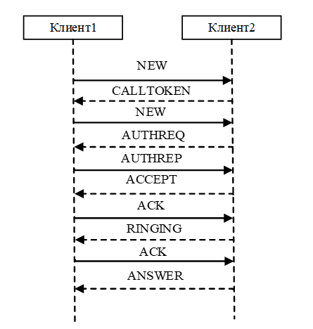

*Рис 3.2. Диаграмма обмена сообщениями при совершении вызова*

Происходит разговор клиента 2 с клиентом 1 (периодически посылаются сообщения **LAGRQ** (Request) **LAGRP** (Response) для определения задержки между узлами). Вызов завершается клиентом 1 (сообщение **HANGUP**) (Рисунок 3.4).

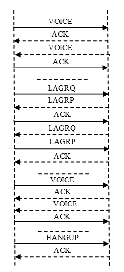

*Рис 3.3. Диаграмма разговора клиента 2 с клиентом 1 (периодически посылаются сообщения **LAGRQ** (Request) **LAGRP** (Response)*

### 3.2. Настройка транка IAX в Asterisk

Приведенная ниже конфигурация предполагает, что оба клиента осуществляют взаимную регистрацию (схема *peer-to-peer* для равноправных узлов), в других ситуациях регистрация может быть односторонней (схема *клиент-сервер*), как например при подключении корпоративной АТС к провайдерской.

Удалите сгенерированный по умолчанию файл конфигурации **IAX**:

```
sudo rm /etc/asterisk/iax.conf
```

Конфигурация протокола **IAX** для данной работы должна производиться в новом файле */etc/asterisk/iax.conf*, добавьте следующие строки:

***

На **node1**:

```
[iaxuser1]
type=friend
qualify=yes
auth=md5
context=outcall
secret=secret1
host=dynamic
trunk=yes
```
На **node2**:

```
[iaxuser2]
type=friend
qualify=yes
auth=md5
context=outcall
secret=secret2
host=dynamic
trunk=yes
```

***

В приведенной конфигурации создается пользователь с именем, указанным в [] и паролем, заданным параметром secret, от имени которого удаленный узел сможет зарегистрироваться на данном Asterisk. Указанный тип friend дает пользователю право отправлять и принимать вызовы (существуют также типы user и peer, первый позволяет ТОЛЬКО принимать вызовы от удаленного узла, второй - ТОЛЬКО перенаправлять их на удаленный узел).

Параметр qualify включает опрос доступности удаленного узла (отправка сообщения POKE, ожидание в ответ PONG, отправка подтверждения получения ответа PONG сообщением ACK),  параметр auth определяет тип аутентификации (по умолчанию происходит аутентификация с передачей учетных данных в открытом текстовом виде) md5 - передача хешированных данных. Параметр context определяет, в какой(ие) локальный(е) контекст(ы) должен быть передан пришедший из IAX-канала вызов.

Настройка взаимной регистрации IAX-серверов. Для этого добавьте в начало файла */etc/asterisk/iax.conf :*

на **node1**:

***
```
[general]
autokill=yes
language=ru
disallow=all
allow=opus,alaw
register => iaxuser2:secret2@A.B.C.D
```
>где A.B.C.D IP адрес node1 (IP_node1 далее)


На node2 :

***
```
[general]
autokill=yes
language=ru
disallow=all
allow=opus,alaw
register => iaxuser1:secret1@A.B.C.D
```
>где A.B.C.D IP адрес node2 (IP_node2 далее)

Рассмотрим конфигурацию, проделанную на node1. Она предписывает узлу node1 зарегистрироваться на узле node2 с IP-адресом IP_node2 под пользователем iaxuser2 с паролем secret2. Параметр autokill=yes завершает неудачно установленные соединения по тайм-ауту.

Для принятия изменений перезагрузите службу Asterisk:

```
sudo systemctl restart asterisk
```

Проверка состояния регистрации данного узла на удаленном:
```
sudo asterisk -rx 'iax2 show registry'
```

*Данная команда демонстрирует, как можно выполнять любые команды CLI Asterisk (и получать ответный вывод) напрямую из bash.*

В полученном выводе State должно быть Registered (т.е. локальный Asterisk успешно зарегистрировался на удаленном). Состояние Rejected означает, что в регистрации было отказано, следует выяснить и устранить причину (Рисунок 3.5).


*Рис 3.4. Появление ошибки отказа в регистрации*

Состояние регистрации удаленного узла на данном:

```
sudo asterisk -rx 'iax2 show peers'
```

Status должен быть OK, а внизу указано, что есть 1 online (Рисунок 3.6).


*Рис 3.5. Данные об успешной регистрации*

Вся необходимая конфигурация IAX выполнена, осталось только указать обоим узлам, вызовы на какие номера нужно передавать через IAX-подключение к другому Asterisk.

Для обработки приходящих из IAX-транка вызовов, на обоих узлах нужно добавить указанный ранее в конфигурации IAX контекст outcall в файл /etc/asterisk/extensions.conf:

На node1:

```
[outcall]
exten => _4XXX,1,Dial(PJSIP/${EXTEN})
```

На node2:

```
[outcall]
exten => _5XXX,1,Dial(PJSIP/${EXTEN})
```

В файле /etc/asterisk/extensions.conf добавьте в начало контекста, отвечающего за обработку внутренних звонков экстеншн для обработки вызовов, уходящих в IAX-транк:

на узле node1:

> exten => _5XXX,1,Dial(IAX2/iaxuser2:secret2@IP_node2/${EXTEN})

И аналогично для node2:

>exten => _4XXX,1,Dial(IAX2/iaxuser1:secret1@IP_node1/${EXTEN})

Перезагрузите Asterisk:

```
sudo systemctl restart asterisk
```
Настройте клиенты PhonerLite на обеих сторонах для регистрации под соответствующим номером 4XXX или 5XXX. На обоих узлах Asterisk откройте командный интерфейс Asterisk (sudo asterisk -vvvr). **Совершите звонок между клиентами.** Убедитесь, что на обеих сторонах в консоли Asterisk отображаются служебные сообщения PJSIP, IAX об установлении соединения и информация о задействованных при обработке вызова экстеншенах. Если вышеуказанные условия выполнены и вызов успешно совершается, можно переходить к следующей части работы.

Используемый на текущий момент способ хранения конфигурации Asterisk в текстовых файлах имеет ряд недостатков, основной из которых – необходимость при малейшем изменении конфигурации перезагружать соответствующий модуль или вообще Asterisk в целом. В высоконагруженных средах даже субсекундный простой, вызванный этим действием, абсолютно неприемлем, не говоря о невозможности сохранить текущие звонки и очередь после перезагрузки.

Проблему динамического изменения конфигурационных параметров Asterisk решает так называемая **Realtime конфигурация**, при которой конфигурационные параметры хранятся в таблицах **базы данных (БД)** вместо текстовых файлов. Изменение значения какого-либо параметра в таблице приводит к немедленному изменению в работе Asterisk (однако не всегда хранение параметров в БД означает realtime, можно сконфигурировать статическое хранение параметров, при котором после внесения изменений в базу потребуется перезагрузить Asterisk для принятия изменений).

### 3.3. Теоретические сведения о реляционных БД и SQL
**Реляционная БД** – набор данных, организованных в виде таблиц, включающих в себя *столбцы* (поля/атрибуты) и *строки* (записи/кортежи). Строка таблицы по сути – это набор данных, относящихся к хранимому в БД объекту. Таблицы БД, также называемые отношениями (relation), имеют, согласно реляционной модели, следующие свойства:

- столбцы имеют определенный порядок, заданный при создании таблицы, которая может не иметь строк, но обязана иметь хотя бы один столбец;

-	таблица не может хранить две одинаковые строки;

-	каждый столбец имеет уникальное в пределах таблицы имя и хранит значения одного типа (дата, строка, число и т.д.);

-	на пересечении строки и столбца (в ячейке) таблицы может быть только атомарное значение (т.е. единичное, не группа значений).


Согласно этой же модели, любой элемент данных (ячейка) в таблице может быть однозначно идентифицирован именем столбца и значением в ячейке столбца, выбранного в качестве первичного ключа.

**Первичный ключ (Primary key)**
Может быть **логическим** (*естественным* - на основе поля, содержащего реальные данные объекта) или **суррогатным** (*искусственным* – на базе дополнительного поля, например, уникального ID). Рекомендуется использовать суррогатные ключи, поскольку данные объекта могут измениться, что приведет к необходимости удалять существующую запись и вносить новую, т.к. первичные ключи изменять нельзя.


**Внешние ключи (Foreign key)** позволяют связать строки и отдельные элементы разных таблиц.


Аспекты реляционных БД.

-	SQL – (язык структурированных запросов) основной интерфейс для работы с реляционными БД, используется для добавления, обновления и удаления строк данных, а также управления работой БД в целом;

-	целостность данных (через определение первичных и внешних ключей, а также ограничений (атрибутов столбца, см. в справочнике запросов SQL));

-	транзакция – последовательность операций на языке SQL, представляющая собой единую логическую задачу. Она должна быть выполнена целиком, либо не должен быть выполнен ни один из ее компонентов, независимо от других транзакций.


Требования ACID к транзакциям

-	атомарность – транзакция может выполниться только целиком, если не выполнена любая из частей - вся транзакция полностью отменяется;

-	единообразие – все данные, записываемые в БД через транзакции, должны соответствовать всем правилам и ограничениям БД;

-	изолированность – обеспечения согласованности и гарантия независимости каждой транзакции;

-	надежность – все внесенные транзакцией изменения в БД на момент успешного завершения этой транзакции считаются постоянными.


Далее будет приведен краткий список некоторых команд SQL (пункт 3.5).

### 3.4. Установка СУБД MariaDB

MariaDB представляет собой систему управления реляционными базами данных, является свободным ответвлением (распространяется по лицензии GNU GPL) от СУБД MySQL, при этом сохраняя обратную совместимость для API.

### Задание

### Необходимо установить **самостоятельно** установить СУБД MariaDB на свою виртуальную машину. Осуществите первичную настройку параметров безопастности пользователя СУБД.

Проверьте возможность локального подключения к СУБД

```
mysql -u root -p
```

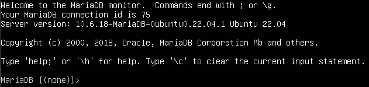

Рис 3.6. Проверка возможности локального подключения к СУБД

Выход в интерпретатор bash производится следующей командой: \q

### 3.5. Краткий справочник запросов SQL

Отобразить все созданные БД;

```
SHOW DATABASES;
```

<details>
  <summary>Примечание</summary>
В SQL в конце команды требуется писать **;**
</details>


Создать базу; таблицу с описанием столбцов (имя, тип данных, указание атрибутов (опционально)):

***
```
CREATE DATABASE databasename;

CREATE TABLE table_name (

    column1 datatype attribute,

    column2 datatype,

    column3 datatype,
         ...
);
```
***

**Примеры атрибутов:**

**PRIMARY KEY** – указание столбца в качестве первичного ключа (NOT NULL присваивается автоматически);

**UNIQUE** – указание, что столбец должен хранить только уникальные значения;

**NULL и NOT NULL** – указание, может ли столбец хранить значение NULL;

**AUTO_INCREMENT** – значение столбца столбца будет автоматически увеличиваться при добавлении новой строки.


**Записать в таблицу новую строку:**
~~~
INSERT INTO table_name (column1, column2) VALUES (value1,value2);
~~~

Обновить существующую(ие) строку(и), которые подпадают под условие(я):

~~~
UPDATE table_name SET column1 = value1, column2 = value2, … WHERE condition1 AND condition2;
~~~

Выбрать все строки из таблицы:

~~~
SELECT * FROM table_name;
~~~

Удалить базу, таблицу, строку из таблицы:

~~~
DROP DATABASE databasename;
~~~

~~~
DROP TABLE table_name;
~~~

~~~
DELETE FROM table_name WHERE condition;
~~~

Далее приведены команды для создания БД и ее конфигурации на языке SQL, который традиционно используется для управления реляционными БД. Обратите внимание, запрос SQL ВСЕГДА заканчивается символом «;». Команды SQL выполняются в интерфейсе СУБД (вход mysql -u root -p ).

Создайте БД с именем asteriskdb с символьной кодировкой UTF8 по умолчанию:

~~~
CREATE DATABASE asteriskdb DEFAULT CHARACTER SET utf8 DEFAULT COLLATE utf8_general_ci;
~~~

На следующем шаге создайте пользователя СУБД, под которым Asterisk будет подключаться к СУБД, имя и пароль выберите самостоятельно.

~~~
CREATE USER 'имя_пользователя'@'localhost' IDENTIFIED BY 'пароль';
~~~

Выдайте права полного доступа на базу asteriskdb созданному на предыдущем шаге пользователю, обновите действующие права.

~~~
GRANT ALL PRIVILEGES ON asteriskdb.* TO 'имя_пользователя'@'localhost';
~~~

~~~
FLUSH PRIVILEGES;
~~~

Выберите базу для работы (по умолчанию после входа в СУБД база не выбрана):

~~~
USE asteriskdb;
~~~

Создайте в выбранной базе таблицы, необходимые Asterisk для хранения своих данных с помощью готовых SQL-скриптов.

~~~
source ~/asterisk-18.24.3/contrib/realtime/mysql/mysql_config.sql;
~~~

*Если СУБД возвращает ошибку, убедитесь, что путь до файла существует, проверьте, что версия установленного Asterisk правильная, замените ~ на /home/USERNAME где USERNAME - имя вашего пользователя Ubuntu.*

### 3.6. Сборка и установка коннектора ODBC

Коннектор Open Database Connectivity предоставляет API, с помощью которого сторонние сервисы (Asterisk в данном случае) могут получить доступ к БД.


Для работы коннектора требуются пакеты unixODBC unixODBC-devel, они были установлены во время выполнения предыдущей части работы среди зависимостей Asterisk.

Требуется установка пакета cmake.

~~~
sudo apt-get install cmake
~~~

Клонировать репозиторий с исходным кодом в текущую директорию и перейти в него:

```
cd ~
git clone https://github.com/MariaDB/mariadb-connector-odbc.git
cd mariadb-connector-odbc
```
Инициализация и обновление вложенных репозиториев:

```
git submodule init && git submodule update
```

Конфигурация параметров компиляции:

```
cmake -G "Unix Makefiles" -DCMAKE_BUILD_TYPE=RelWithDebInfo -DCONC_WITH_UNIT_TESTS=Off -DWITH_OPENSSL=true -DCMAKE_INSTALL_PREFIX=/usr
```

Конец вывода в терминал в случае успешного завершения сборки выглядит так (Рисунок 3.7).


*Рис 3.7. Успешное завершение собрки*

Сборка и установка:

```
make
sudo make install
```
В  файл /etc/odbcinst.ini добавьте описание нового драйвера подключения к СУБД (если уже существует с именем [MariaDB], приведите к представленному ниже виду):
```
[ODBC Drivers]
MariaDB=Installed

[MariaDB]
Description=MariaDB Connector/ODBC
Driver=/usr/lib/mariadb/libmaodbc.so
UsageCount=1
```

В файл /etc/odbc.ini добавьте параметры подключения к базе:

```
[Asterisk-odbc]
Description=MariaDB connection to 'asteriskdb' database
driver=MariaDB
server=localhost
database=asteriskdb
Port=3306
Socket=/run/mysqld/mysqld.sock
option=3
Charset=utf8
```

Проверить, какие драйверы зарегистрированы (если при вводе команды ничего нет, то ошибка в файле /etc/odbcinst.ini):
```
odbcinst -q -d
```


*Рис 3.8. Пример вывода команды odbcinst -q -d*

Проверить, какие источники данных зарегистрированы (если при вводе команды ничего нет, то ошибка в файле /etc/odbcinst.ini):
```
odbcinst -q -s
```


*Рис 3.9. Пример вывода команды odbcinst -q -s*

Проверка работоспособности коннектора (подключение к базе asteriskdb от имени созданного для Asterisk пользователя СУБД) (Рисунок 3.9).

```
isql -v Asterisk-odbc имя_пользователя пароль
```


*Рис 3.10. Проверка работоспособности коннектора*

В начало (перед строкой [asterisk]) файла */etc/asterisk/res_odbc.conf* добавьте конфигурацию для ODBC коннектора:

***
```
[asteriskdb]
enabled => yes
dsn => Asterisk-odbc
username => имя_пользователя
password => пароль
pre-connect => yes
```
***

**Перезапустите службу Asterisk:**

```
sudo systemctl restart asterisk
```

**Проверка состояния подключения Asterisk к БД (Рисунок 3.10):**

```
sudo asterisk -rx 'odbc show'
```


*Рис 3.11. Проверка состояния подключения Asterisk к БД*


### 3.7. Перенос конфигурации PJSIP в БД.

В начало файла */etc/asterisk/sorcery.conf* вставьте следующие строки для перевода PJSIP в режим конфигурации Realtime:

***
```
[res_pjsip]

endpoint=realtime,ps_endpoints

auth=realtime,ps_auths

aor=realtime,ps_aors

domain_alias=realtime,ps_domain_aliases

contact=realtime,ps_contacts

[res_pjsip_endpoint_identifier_ip]

identify=realtime,ps_endpoint_id_ips
```
***

В файл */etc/asterisk/extconfig.conf* добавьте после строки [settings] сведения, где Asterisk должен искать конфигурацию для PJSIP:

***
```
ps_endpoints => odbc,asteriskdb

ps_auths => odbc,asteriskdb

ps_aors => odbc,asteriskdb

ps_domain_aliases => odbc,asteriskdb

ps_endpoint_id_ips => odbc,asteriskdb

ps_contacts => odbc,asteriskdb
```
***
### ПРИМЕР

#### Для вставки новых строк в таблицу используется запрос INSERT, параметр  INTO указывает в какую таблицу вставить (указывается полный путь в формате БД.Таблица или просто имя таблицы при условии, что БД была выбрана ранее через USE), далее в скобках следует перечисление имен столбцов через запятую, в которые нужно вставить данные (это не обязательно все столбцы таблицы), после VALUES в скобках указываются в соответствующем перечисленным в первой скобке именам столбцов порядке значения.

Далее в качестве примера приведен процесс создания клиента PJSIP с номером 101, путем заполнения значениями трех ключевых таблиц:

**-ps_aors**
```
INSERT INTO asteriskdb.ps_aors (id, max_contacts) VALUES (101, 1);
```
**- ps_auths**
```
INSERT INTO asteriskdb.ps_auths (id, auth_type, password, username) VALUES (101, 'userpass', 'secret', 101);
```
**- ps_endpoints**
```
INSERT INTO asteriskdb.ps_endpoints (id, transport, aors, auth, callerid, context, disallow, allow, direct_media) VALUES (101, 'udp-transport', '101', '101', 'first<101>', 'internal', 'all', 'opus,alaw', 'no').
```

**Это аналог следующей конфигурации из файла pjsip.conf:**

***
```
[101]
type=endpoint
transport=udp-transport
context=internal
disallow=all
allow=alaw,opus
callerid=first<101>
auth=101
aors=101
direct_media=no

[101]
type=auth
auth_type=userpass
password=secret
username=101

[101]
type=aor
max_contacts=1
```
***
### Задание

#### Войдите в СУБД и аналогично примеру создайте записи в таблицах ps_aors ps_auths ps_endpoints БД asteriskdb, описывающие конфигурацию для всех описанных в файле pjsip.conf клиентов. В файле /etc/asterisk/pjsip.conf удалите все секции, принадлежащие клиентам, оставьте ТОЛЬКО секцию [udp-transport]  и все параметры в ней. Проверьте, что SIP-клиент может зарегистрироваться на Asterisk после перезапуска службы.

### 3.8. Установка веб-интерфейса phpMyAdmin для MariaDB

Для удобства управления MariaDB можно использовать веб-интерфейс для MySQL (MariaDB) – phpMyAdmin, представляющий собой готовое веб-приложение, написанное на языке PHP. Может быть работать на базе LAMP (Linux, Apache, MariaDB, PHP) или LEMP (Linux, NGINX, MariaDB, PHP) стека. В рамках данной работы примем за основу LEMP. Поскольку MariaDB уже присутствует в системе, остаётся установка веб-сервера NGINX и интерпретатора PHP с некоторыми дополнительными пакетами.

Установка веб-сервера NGINX:
```
sudo apt install -y nginx
```

Основная конфигурация NGINX содержится в файле /etc/nginx/nginx.conf, его структура представлена ниже:

***
```nginx
global options

events {

.......

}

http{

.......

include /etc/nginx/conf.d/*.conf;

}
```
***

Сначала идут глобальные параметры (global options), которые задают основные параметры работы NGINX, например, от какого пользователя будет запущен процесс, а также количество одновременно запущенных процессов. В секции events описывается, как NGINX должен реагировать на входящие подключения, ниже расположена секция http, объединяющая все параметры, связанные с работой протокола HTTP. Последняя директива говорит, что дополнительно в конфигурацию секции http включаются все файлы с расширением .conf из директории */etc/nginx/conf.d*, эти файлы могут как содержать дополнительные параметры http, так и секции server c вложенными секциями location. По умолчанию существует файл */etc/nginx/conf.d/default.conf* который ответственен за настройки сайта по умолчанию, отображение проверочной страницы NGINX после установки, его структура представлена ниже.

***
```nginx
server {

.......

location ...{

.......

}

}
```
***

Обычно в секции http находится одна или несколько секций server, каждая секция отвечает за отдельный домен (доменное имя сайта), в секции server размещаются секции location, каждая из которых отвечает за обработку запроса с определенным URL.

Для оптимизации производительности отредактируйте и добавьте недостающие параметры в основной файл конфигурации NGINX */etc/nginx/nginx.conf:*

**1.	Глобальные параметры. Исправьте/добавьте под параметром user:**

worker_processes  auto;

worker_cpu_affinity  auto;

    Эти параметры оптимизируют производительность рабочих процессов NGINX и их количество под число доступных ядер CPU.

**2.	Настройка обработки соединений, добавьте следующие параметры внутри, блока events :**

    multi_accept on;

    use epoll;


Параметр  use epoll – устанавливает оптимальный метод обработки соединений для Linux. Когда multi_accept выключен, рабочий процесс NGINX за один раз будет принимать только одно новое соединение. В противном случае рабочий процесс за один раз будет принимать сразу все новые соединения.

**3.	Параметры HTTP.  Добавьте/скорректируйте следующие параметры:**

    access_log     off;
    server_tokens  off;
    tcp_nopush      on;
    tcp_nodelay     on;
    reset_timedout_connection    on;
    gzip  on;
    gzip_static on;
    gzip_min_length     1024;
    gzip_comp_level 3;


Для ускорения работы и снижения нагрузки на диск в текущей установке можно отключить ведение лога доступа к веб-серверу через директиву access_log. Директива server_tokens при выставлении параметра в off предписывает NGINX не отсылать информацию о своей версии клиентам. Это может быть полезно, если вы хотите усложнить эксплуатацию ошибок и уязвимостей конкретной версии NGINX. Директивы tcp отвечают за ускорение работы транспортного протокола TCP, keepalive_timeout и reset_timedout_connection отвечают за таймер keepalive для сетевого соединения (время, в течение которого соединение остается открытым с момента последнего ответа клиента на сообщение keepalive) и разрыв соединений с истекшим таймером. Директивы gzip включают сжатие передаваемых данных, предварительное сжатие статических файлов и минимальный размер файла, подлежащего сжатию.

Сохраните файл конфигурации и проверьте его корректность (Рисунок 3.12):
```
sudo nginx -t
```
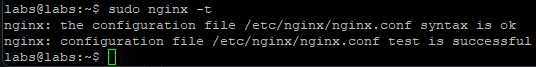

*Рис 3.12. Сохранение файла конфигурации и проверка его корректности*

Если на предыдущем шаге проверка пройдена, запустите службу NGINX с автозапуском на старте ОС:

>sudo systemctl start nginx && sudo systemctl enable nginx

Откройте в фаерволе 80 порт для доступа к веб-интерфейсу.

>sudo ufw allow 80


Проверьте, что по URL http://IP_Ubuntu в браузере отображается тестовая страница Nginx.


### 3.9. Установка phpMyAdmin

Ubuntu 20.04 по умолчанию предлагает PHP 7.4, что совместимо с phpMyAdmin.

Установите PHP-FPM и необходимые модули:
>sudo apt install -y php-fpm php-mysql php-mbstring php-zip php-gd php-json php-curl

Проверьте версию PHP:

>php -v

Ожидаемый вывод: что-то вроде PHP 7.4.x.

На Ubuntu phpMyAdmin доступен в репозиториях

>sudo apt install -y phpmyadmin 

В процессе установки будет предложена возможность использовать утилиту dbconfig-common для автоматической настройки базы данных, необходимой для работы phpMyAdmin (Рисунок 3.X). На данном этапе это не нужно. 

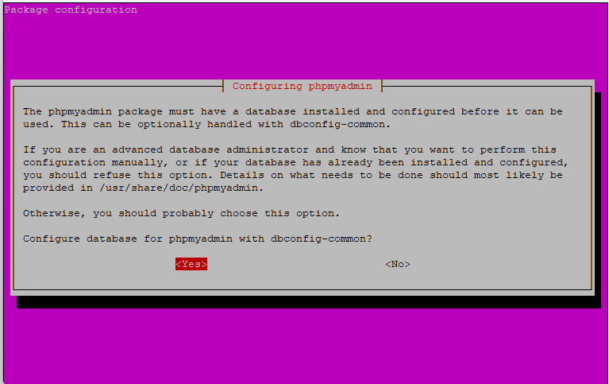

*Рис 3.13. Конфигурация phpmyadmin*

Также, можно выбрать веб-сервер (Apache или Lighttpd), который будет автоматически сконфигурирован для работы с phpMyAdmin. Мы работаем с Nginx, а не с Apache или Lighttpd, поэтому здесь ничего выбирать не нужно.

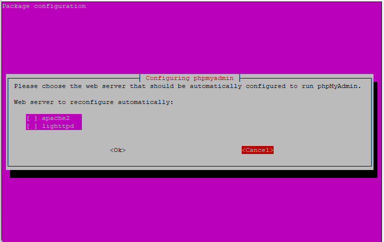

*Рис 3.14. Конфигурация phpmyadmin. Выбор веб-сервера*

Файлы phpMyAdmin будут установлены в */usr/share/phpmyadmin*

### 3.10. Настройка Nginx для phpMyAdmin

Создайте файл конфигурации для NGINX:

>sudo nano /etc/nginx/conf.d/phpmyadmin.conf

Содержимое файла должно быть следующим:

```nginx
server {
    listen 80;
    server_name _;  
    root /usr/share/phpmyadmin;
    index index.php index.html index.htm;

    location / {
        try_files $uri $uri/ /index.php?$args;
    }

    location ~ \.php$ {
        include fastcgi_params;
        fastcgi_pass unix:/run/php/php7.4-fpm.sock;
        fastcgi_index index.php;
        fastcgi_param SCRIPT_FILENAME $document_root$fastcgi_script_name;
    }
}
```

/ – корень сайта, перехватывает все запросы к домену, если не найдено более точное совпадение.

~ \.php$ – перехватывает запросы к файлам с расширением php. То есть если в запросе указан файл  .php, то запрос отправляется на обработку к php-fpm.

Проверьте конфигурацию NGINX:

>sudo nginx -t

Если всё хорошо, перезапустите Nginx:

>sudo systemctl restart nginx


### 3.11. Работа в интерфейсе phpMyAdmin

Войдите в веб-интерфейс phpMyAdmin, используя URL http://IP_Ubuntu в браузере. В качестве учетных данных для входа используйте пользователя root СУБД.


Для сохранения конфигурации phpMyAdmin требуется отдельная БД, чтобы создать ее, найдите внизу страницы соответствующее сообщение (приведено ниже), нажмите на ссылку Find out why и на следующей странице нажмите Create (Рисунок 3.15).


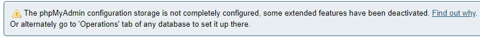

*Рис 3.15. Сохранение конфигурации phpMyAdmin*

Выберите слева базу asteriskdb, в ней таблицу ps_endpoints. Нажмите на... Создать представление (Create view) (Рисунок 3.16).

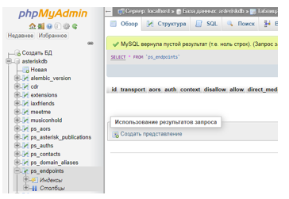

*Рис 3.16. Создание представления*


В появившемся окне укажите название ps_endpoints_view, в названия столбцов вставьте укажите id, callerid, aors, auth, context, transport, disallow, allow, direct_media (Рисунок 3.17).


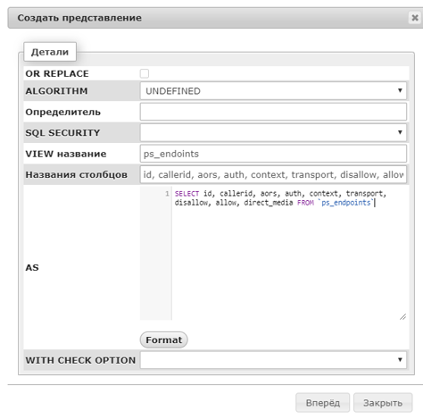

*Рис 3.17. Настройки параметров представления*

Ниже вставьте *SELECT id, callerid, aors, auth, context, transport, disallow, allow, direct_media FROM \`ps_endpoints\`* Нажмите Format, для форматирования кода (так выглядит эталонная запись запросов на SQL).

Нажмите вперёд, после этого слева, в новом разделе для asteriskdb - Представления (Views) выберите представление ps_endpoints_view. Убедитесь, что в таблице отображается запись со всеми настроенными параметрами из раздела endpoints.

Представление (View) делает возможным отобразить выбранные данные из таблиц БД в виде настраиваемой таблицы (в отображении можно выбрать конкретные столбцы, переименовать их, соединить несколько). Данное представление ps_endpoints_view было создано для удобства отображения нужных параметров, поскольку если посмотреть, какие столбцы содержит таблица ps_endpoints, можно убедиться, что их число достаточно велико, причем большинство пустует ввиду отсутствия нужды задавать те параметры, которые эти столбцы хранят, а нужные столбцы разбросаны по всей ширине таблицы, что затрудняет читабельность. Для оставшихся таблиц ps_aors и ps_auths можно не создавать представление как можете самостоятельно убедиться, число столбцов в них невелико.

Во вкладке Структура можно настраивать столбцы, которые содержит текущая выбранная таблица, во вкладке SQL – писать SQL-запросы, в Поиск находить нужную строку по значениям полей. Вкладка Вставить предлагает возможность добавления строк в таблицу с помощью заполнения графической формы.

Для ускорения поиска данных и их сортировки, в таблице используются индексы, которые назначаются из числа столбцов таблицы (отображены слева в древовидной структуре таблицы). Индексы могут быть уникальными (все соответствующие значения столбцов во всех строках должны быть различны), составными (содержать более одного столбца – в этом случае уникальность проверяется по составной строке из всех указанных столбцов индекса), кластерными (хранятся данные записей таблицы целиком) и некластерными (хранятся только ссылки на записи таблицы). Каждая таблица должна иметь Первичный ключ, который обязан быть уникальным (среди всех значений данного столбца) и единственным (в одной таблице), первичные ключи таблиц InnoDB являются кластерными индексами.  Первичный ключ может быть назначен вручную (в Структуре таблицы в phpMyAdmin будет помечен символом золотого ключа), или создан автоматически (скрыт в таком случае).

### 3.11. Перенос конфигурации плана набора (extensions) в БД

В файле /etc/asterisk/extconfig.conf добавьте в секцию [settings] строку:

>extensions => odbc,asteriskdb

В /etc/asterisk/extensions.conf в начало каждого контекста добавьте строку:

> switch => Realtime/ИМЯ_КОНТЕКСТА@extensions

Пример переноса контекста outcall на node1 в БД:


В файле /etc/asterisk/extensions.conf добавить в начало переносимого контекста строку:


>[outcall]

>switch => Realtime/outcall@extensions


Добавление данных об экстеншенах в таблицу extensions:

> INSERT INTO extensions VALUES (1, 'outcall', '_1XXX', '1', 'DIAL', 'PJSIP/${EXTEN}');

Не забудьте выбрать базу asteriskdb, в интерфейсе СУБД.

Перезапустите Asterisk, проверьте работоспособность (вызовы совершаются успешно).

### Задание

#### Аналогично приведенному примеру (используя SQL-запросы) или через графическую форму во вкладке Вставить (Insert) в phpMyAdmin, перенесите всю имеющуюся конфигурацию плана набора в таблицу extensions, удалите все записи об экстеншенах из файла extensions.conf (кроме параметров switch).

### 3.12. Перенос конфигурации IAX в БД

В файл /etc/asterisk/extconfig.conf добавьте строку

> iaxfriends => odbc,asteriskdb

Пример.

В файле /etc/asterisk/iax.conf


добавьте в начало секции [general] строку:

> rtcachefriends=yes;

Перенести конфигурацию пользователя IAX в БД:
```SQL
INSERT INTO `iaxfriends` (`id`, `name`, `type`,  `secret`, `context`, `host`, `trunk`, `auth`, `qualify`) VALUES ('1', 'iaxuserX', 'friend', 'secretX', 'outcall', 'dynamic', 'yes', 'md5', 'yes');
```

Удалить всю секцию пользователя из iax.conf;

Перезапустить Asterisk, проверить работоспособность IAX.

### Задание

#### Аналогично приведенному примеру (используя SQL-запросы) или через графическую форму во вкладке Вставить в phpMyAdmin, перенесите всю имеющуюся конфигурацию IAX в таблицу iaxfriends. Проверьте работоспособность после переноса конфигурации в Realtime.

## Раздел 4. Настройка безопасного удаленного доступа к серверу Asterisk. Защита передаваемых данных

Будет доступно после сдачи 3 части.
